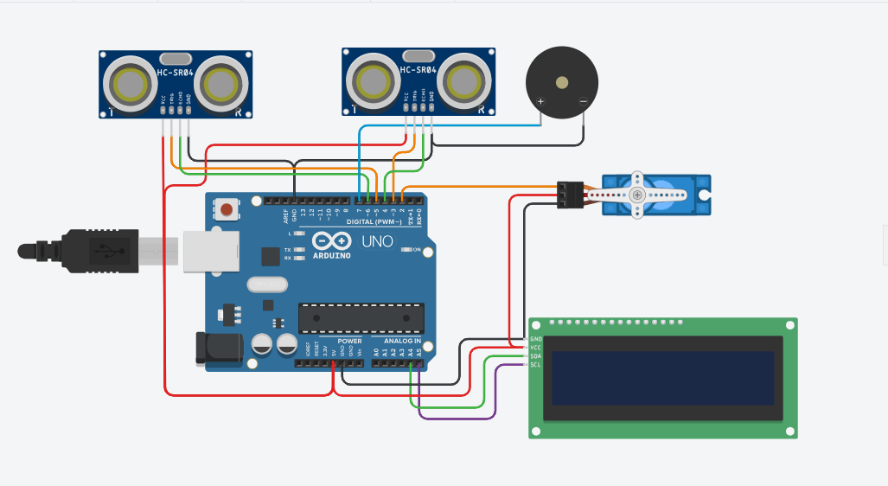
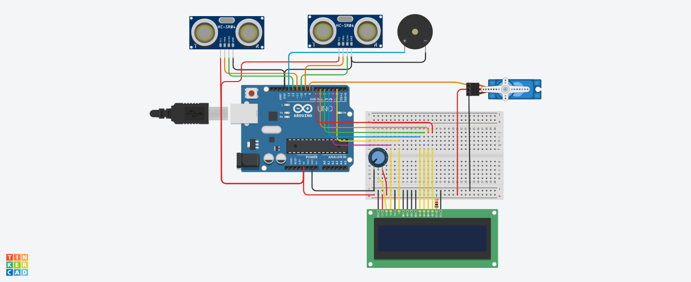

# Projet de Barrière Automatique Arduino

## @AUTEUR : Exaucé KIMBEMBE / @OpenProgramming
- DATE : 10/06/2023
- e-mail : openprogramming23@gmail.com
- gitHub : https://github.com/RS-malik-el
- Donation : paypal.me/RachelSysteme

Ce projet consiste en la conception et la mise en œuvre d'une barrière automatique à l'aide d'une carte Arduino. La barrière est contrôlée par un microcontrôleur Arduino et utilise divers composants électroniques pour détecter les véhicules et contrôler l'ouverture et la fermeture de la barrière.

*@Outils*
- (1) Une carte arduino
- (2) Deux capteurs ultrason HC-SR04
- (1) un servomoteur
- (1) un ecran lcd simple ou I2C
- (1) un bipeur 

## Fonctionnalités principales

- Détection des véhicules 
- Contrôle de la barrière 
- Interface utilisateur (ecran lcd)

## Images

*Description : Schema de montage avec écran lcd I2C.*

*Description : Schema de montage avec écran lcd non I2C.*

